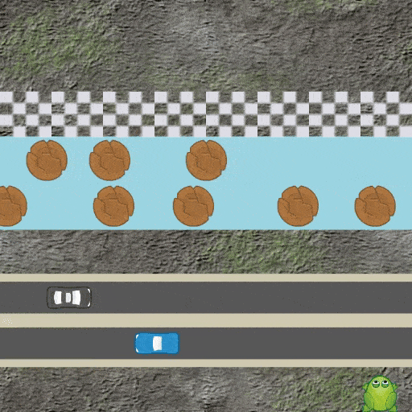
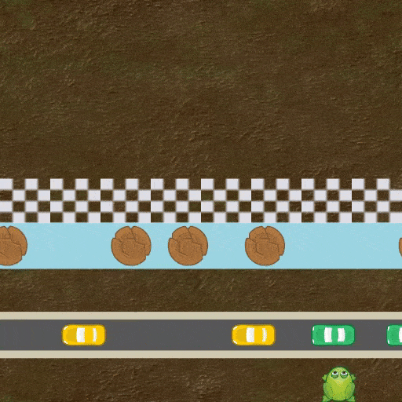
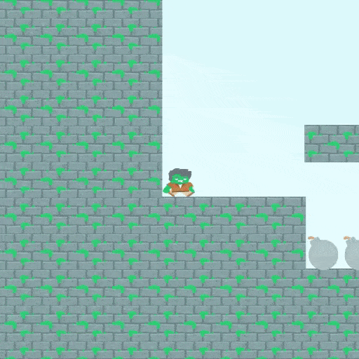
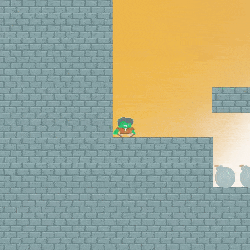
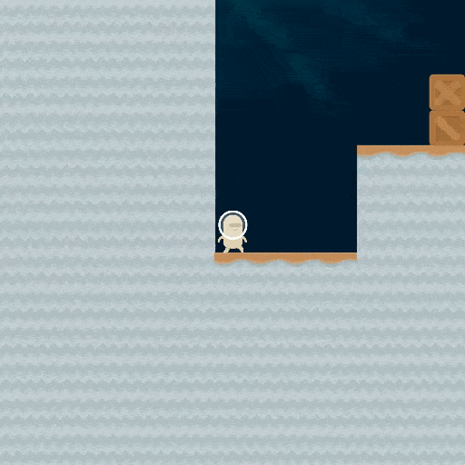
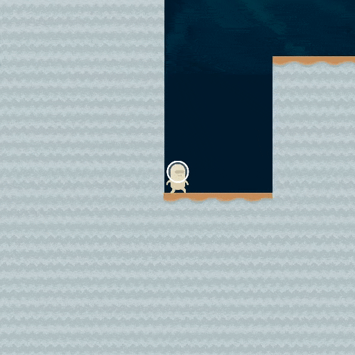

# REINFORCE vs PPO
Policy gradient methods have been already used for solving a huge variety of reinforcement learning (RL) problems, and there exist different algorithms based on them.The goal of this project is to implement and to compare two of these algorithms: the REINFORCE and the Proximal Policy Optimization (PPO).
The implementation and the experiments are based on three different environments, found in the OpenAI’s Procgen Benchmark. In particular, the environments are: Coinrun, Ninja and Leaper.

## Run the project
For running the project it is sufficient to have installed all the dependecies specified in the **requirements.txt**, and then execute the file **main.py**.

The project is already configured to:
* load the model weights for the Leaper game
* start in evaluation mode (no training)
* save the recording of the matches inside the **/recordings** directory

## Test other games
It is possible to test the trained model also on other games. For doing it, it is necessary to update the **ENVIRONMENT_TYPE** [(config.py#L30)](https://github.com/dsr-lab/aas-reinforce-vs-ppo/blob/main/config.py#L30). Possible values are: 
* LeaperEnvironment
* NinjaEnvironment
* CoinrunEnvironment
 
## Train
It is possible to train the model just by setting **TRAIN=True** [(config.py#L24)](https://github.com/dsr-lab/aas-reinforce-vs-ppo/blob/main/config.py#L24).

**WARNING**: if you need to train a new model from scratch, then you should also update the **WEIGHTS_PATH** [(config.py#L33)](https://github.com/dsr-lab/aas-reinforce-vs-ppo/blob/main/config.py#L33), so as to avoid to automatically load the weights of the pretrained models.

## Project details
Where necessary, the code is already well commented. Additionally, it is possible to find all the theoretical details used for creating the model in the <a href="assets/aas-report.pdf">project report</a>.

## RECORDINGS
What follows are sample recordings taken with the trained models on each game.

### Leaper

  
  

### Ninja

  
  

### Coinrun

  
  

